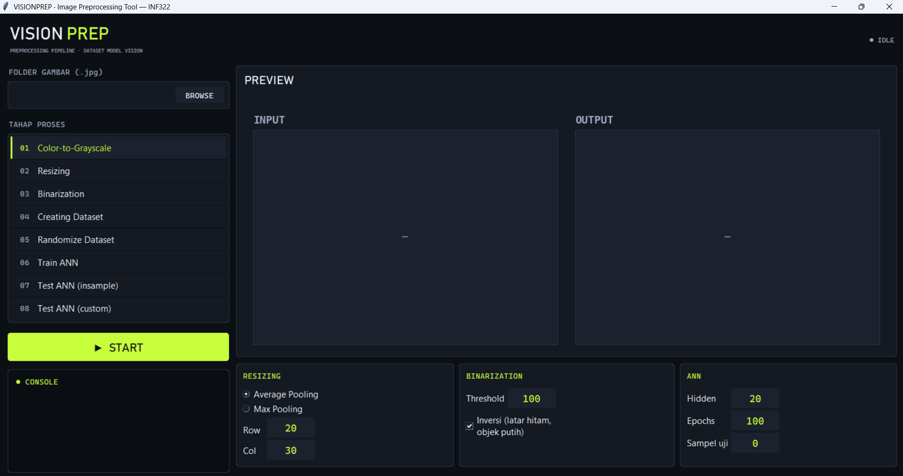

# VisionPrep — Semi-Automatic Image Preprocessing & ANN

Aplikasi desktop GUI untuk **pra-pemrosesan citra semi-otomatis** dan pembuktian
validitas dataset melalui pelatihan **Artificial Neural Network (ANN)**. Dibuat
sebagai proyek UAS mata kuliah **INF322 Image Processing**, Program Studi S1
Informatika, Universitas Pembangunan Jaya.



---

## Ringkasan

VisionPrep mengubah kumpulan gambar mentah (`.jpg`) menjadi dataset numerik siap
latih melalui pipeline lima tahap, lalu membuktikan dataset tersebut valid dengan
melatih ANN sederhana hingga konvergen. Seluruh algoritma pemrosesan citra dan
jaringan saraf ditulis **manual hanya dengan NumPy** — tanpa OpenCV, Pillow,
scikit-image, TensorFlow, atau PyTorch. Visualisasi memakai Matplotlib; antarmuka
memakai Tkinter (pustaka standar Python).

Dataset contoh: **60 gambar huruf Katakana** tulisan tangan (ア / イ / ウ),
masing-masing 20 sampel.

---

## Fitur

| No | Tahap | Keterangan |
|----|-------|------------|
| 1 | **Color-to-Grayscale** | Konversi RGB → grayscale dengan bobot luminansi ITU-R BT.601 (`0.299R + 0.587G + 0.114B`). |
| 2 | **Resizing (Pooling)** | Penskalaan ukuran via **Average** atau **Max Pooling** dengan dimensi keluaran (Row × Col) yang ditentukan pengguna. |
| 3 | **Binarization** | Ambang batas (threshold) + opsi inversi, menghasilkan citra biner objek-putih-latar-hitam. |
| 4 | **Creating Dataset** | Flatten tiap citra biner menjadi satu baris vektor + kolom indeks; label dibuat **one-hot**, kelas dideteksi otomatis dari awalan nama berkas. |
| 5 | **Randomize Dataset** | Pengacakan baris `inputs` & `labels` dengan deret indeks yang sama agar pasangan tetap konsisten. |
| 6 | **Pembuktian — ANN** | Jaringan 1 hidden layer, aktivasi sigmoid, backpropagation, learning rate 0.001. Melatih, menguji in-sample, dan menguji gambar custom. |

---

## Cara Menjalankan

Prasyarat: **Python 3.x**, `numpy`, `matplotlib` (Tkinter biasanya sudah termasuk).

```bash
pip install numpy matplotlib
cd program
python gui.py
```

Alur pakai di GUI:

1. **BROWSE** → pilih folder berisi gambar `.jpg` mentah (mis. folder `dataset/`).
2. Klik salah satu **TAHAP PROSES** (01–08) di panel kiri.
3. Atur parameter (Row/Col, metode pooling, threshold, hidden neuron, epoch) lalu klik **START**.
4. Hasil **INPUT → OUTPUT** tampil di panel preview; berkas keluaran tersimpan di folder yang sama.

Contoh parameter dataset Katakana: Resize `20 × 30`, Average Pooling, threshold `70`, inversi aktif.

---

## Struktur Repository

```
project_uas/
├── program/                  # APLIKASI UTAMA (yang disubmit)
│   ├── gui.py                #   antarmuka Tkinter + Matplotlib (orkestrasi)
│   ├── grayscale.py          #   Tahap 1  — to_grayscale()
│   ├── resizing.py           #   Tahap 2  — resize_pooling() [AVERAGE/MAX]
│   ├── binarization.py       #   Tahap 3  — binarize()
│   ├── dataset.py            #   Tahap 4  — build_dataset()
│   ├── randomize.py          #   Tahap 5  — randomize()
│   ├── ann.py                #   ANN      — sigmoid, ann_train, ann_predict
│   ├── common.py             #   utilitas berkas + konstanta (NumPy/Matplotlib)
│   └── preprocessing.py      #   agregator import semua tahap
│
├── dataset/                  # 60 gambar Katakana mentah (ア/イ/ウ × 20)
│   └── _raw/                 #   gambar sumber asli
│
├── article/                  # artikel ilmiah + pembangkit aset
│   ├── Artikel_INF322_VisionPrep.docx
│   ├── generate_article.py   #   pembangkit dokumen artikel (python-docx)
│   ├── generate_figures.py   #   pembangkit ilustrasi I/O & grafik
│   ├── generate_diagram.py   #   pembangkit diagram alur
│   ├── generate_code_images.py
│   └── figures/              #   semua gambar hasil generate + preview app
│
├── docs/                     # spesifikasi soal + catatan desain
│   └── design.md
│
└── archive/                  # varian alternatif (arsip, non-submit)
    ├── main.py               #   versi modular awal
    ├── main_single.py        #   versi satu-berkas
    ├── processing/           #   modul versi modular awal
    └── test_images/          #   uji coba dataset Hangul
```

---

## Catatan Desain

- **Pemisahan per fitur.** Tiap tahap berada pada berkasnya sendiri dan hanya
  mengimpor `numpy` (kecuali `dataset.py` yang juga memakai `common`), mengikuti
  gaya kode materi M10–M14. `gui.py` adalah satu-satunya berkas yang mengimpor
  `os` (membaca isi folder) dan Tkinter.
- **Tanpa pustaka pihak ketiga di inti.** Grayscale, pooling, binarisasi,
  flattening, pengacakan, dan ANN seluruhnya implementasi NumPy manual.
- **Pembuktian dataset.** ANN dilatih pada dataset hasil pipeline dan mencapai
  akurasi ~98–100% pada 3 kelas Katakana, membuktikan dataset terpisah dengan baik.
