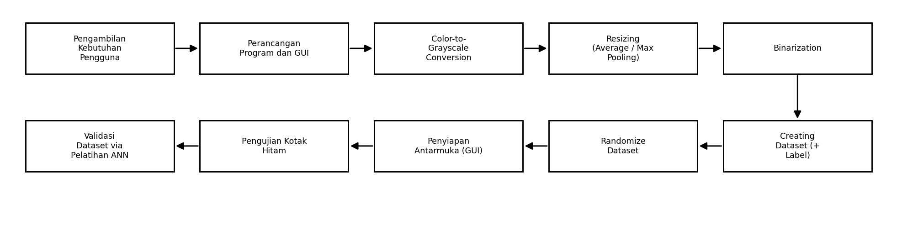
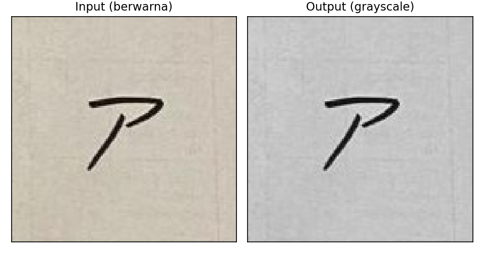
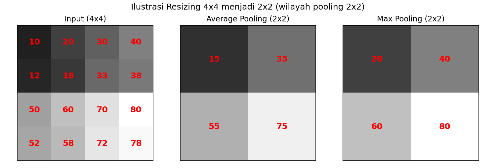
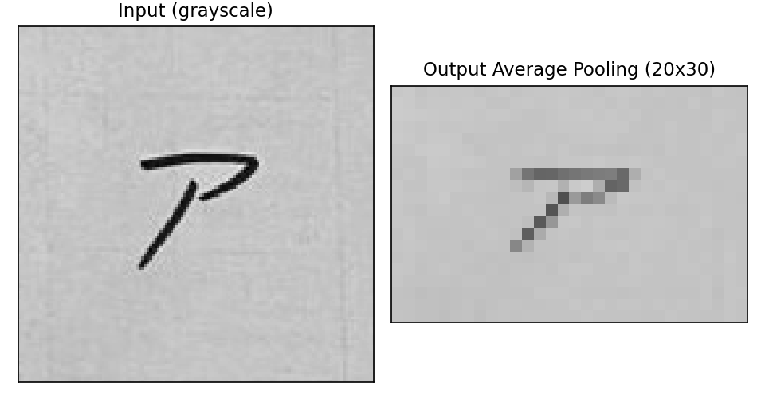
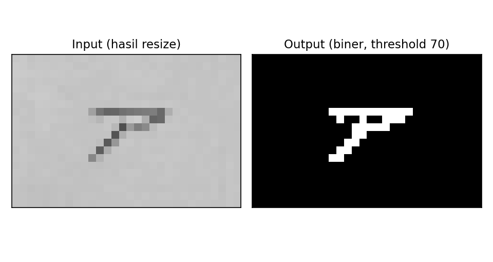
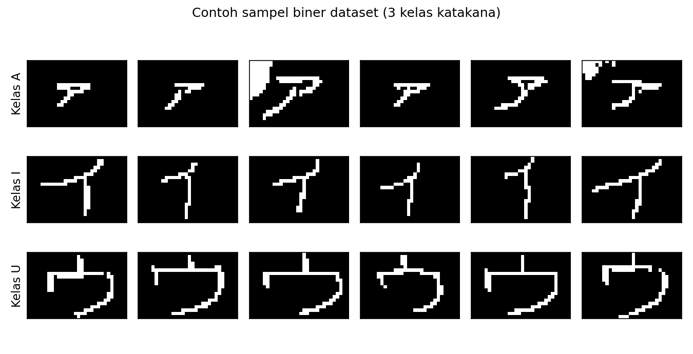
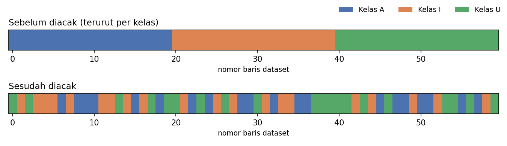
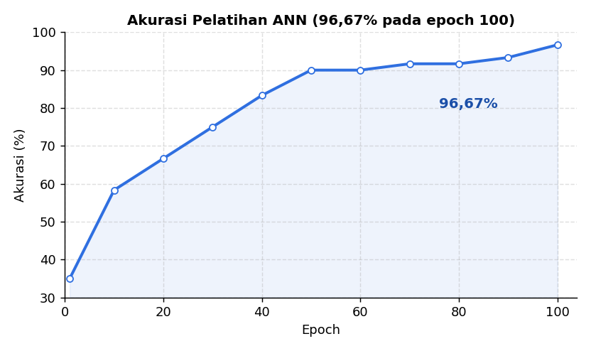

# VisionPrep — Semi-Automatic Image Preprocessing & ANN

VisionPrep adalah aplikasi desktop untuk **pra-pemrosesan citra semi-otomatis**
yang mengubah kumpulan gambar mentah menjadi dataset numerik siap latih, lalu
membuktikan validitas dataset tersebut dengan melatih **Artificial Neural Network
(ANN)** sederhana. Seluruh algoritma pemrosesan citra dan jaringan saraf ditulis
manual hanya dengan **NumPy** — tanpa OpenCV, Pillow, scikit-image, TensorFlow,
maupun PyTorch.

<p align="center">
  
</p>

---

## Ringkasan

VisionPrep menjalankan pipeline lima tahap: grayscale → resizing → binarization →
pembuatan dataset → pengacakan, kemudian melatih ANN hingga konvergen sebagai bukti
bahwa dataset hasil pipeline terpisah dengan baik antar-kelas. Visualisasi memakai
**Matplotlib**, antarmuka memakai **Tkinter** (pustaka standar Python). Pemrosesan
bersifat semi-otomatis: pengguna memilih tahap dan parameter, lalu menekan tombol
START untuk menjalankannya.

Dataset contoh: **60 gambar huruf Katakana** tulisan tangan (ア / イ / ウ),
masing-masing 20 sampel.

### Alur Pipeline

<p align="center">
  
</p>

---

## Fitur

| No | Tahap | Keterangan |
|----|-------|------------|
| 1 | **Color-to-Grayscale** | Konversi RGB → grayscale dengan bobot luminansi ITU-R BT.601 (`0.299R + 0.587G + 0.114B`). |
| 2 | **Resizing (Pooling)** | Penskalaan ukuran via **Average** atau **Max Pooling** dengan dimensi keluaran (Row × Col) yang ditentukan pengguna. |
| 3 | **Binarization** | Ambang batas (threshold) + opsi inversi, menghasilkan citra biner objek-putih-latar-hitam. |
| 4 | **Creating Dataset** | Flatten tiap citra biner menjadi satu baris vektor + kolom indeks; label dibuat **one-hot**, kelas dideteksi otomatis dari awalan nama berkas. |
| 5 | **Randomize Dataset** | Pengacakan baris `inputs` & `labels` dengan deret indeks yang sama agar pasangan tetap konsisten. |
| 6 | **Pembuktian — ANN** | Jaringan 1 hidden layer, aktivasi sigmoid, backpropagation, learning rate 0.001. Melatih, menguji in-sample, dan menguji gambar custom. |

---

## Demonstrasi Tiap Tahap

**1. Color-to-Grayscale** — RGB diringkas menjadi satu kanal intensitas.

<p align="center">
  
</p>

**2. Resizing (Pooling)** — jendela piksel diringkas. Average Pooling merata-ratakan
nilai sehingga goresan tipis tetap terbaca; Max Pooling mengambil nilai maksimum.

<p align="center">
  
</p>

<p align="center">
  
</p>

**3. Binarization** — piksel di atas/di bawah threshold dipetakan ke 0/1, dengan
opsi inversi agar objek menjadi putih di atas latar hitam.

<p align="center">
  
</p>

**4. Creating Dataset** — tiap citra biner di-flatten dan dilabeli, menghasilkan
satu matriks dataset.

<p align="center">
  
</p>

**5. Randomize Dataset** — urutan baris diacak agar pelatihan tidak bias urutan
kelas; pasangan input–label tetap konsisten.

<p align="center">
  
</p>

**6. Pembuktian — ANN** — ANN dilatih pada dataset hasil pipeline dan mencapai
akurasi 96,67% pada 3 kelas Katakana (100 epoch).

<p align="center">
  
</p>

---

## Cara Menjalankan

Prasyarat: **Python 3.x**, `numpy`, `matplotlib` (Tkinter biasanya sudah termasuk).

```bash
pip install numpy matplotlib
cd program
python gui.py
```

Alur pakai di GUI:

1. **BROWSE** → pilih folder berisi gambar `.jpg` mentah (mis. folder `dataset/`).
2. Klik salah satu **TAHAP PROSES** (01–08) di panel kiri.
3. Atur parameter (Row/Col, metode pooling, threshold, hidden neuron, epoch) lalu klik **START**.
4. Hasil **INPUT → OUTPUT** tampil di panel preview; berkas keluaran tersimpan di folder yang sama.

Contoh parameter dataset Katakana: Resize `20 × 30`, Average Pooling, threshold `70`, inversi aktif.

---

## Arsitektur ANN

- **Topologi:** 1 hidden layer; jumlah input neuron = Row × Col, output neuron = jumlah kelas.
- **Aktivasi:** sigmoid pada hidden dan output layer.
- **Pelatihan:** backpropagation, learning rate `0.001`, input dinormalisasi ke rentang 0–1 agar sigmoid tidak saturasi.
- **Bobot awal:** acak seragam `[-0.5, 0.5]`, bias awal nol.
- **Evaluasi:** uji in-sample (akurasi terhadap data latih) dan uji gambar custom melalui forward propagation.

---

## Struktur Proyek

```
visionprep/
├── program/                  # aplikasi utama
│   ├── gui.py                #   antarmuka Tkinter + Matplotlib (orkestrasi)
│   ├── grayscale.py          #   Tahap 1  — to_grayscale()
│   ├── resizing.py           #   Tahap 2  — resize_pooling() [AVERAGE/MAX]
│   ├── binarization.py       #   Tahap 3  — binarize()
│   ├── dataset.py            #   Tahap 4  — build_dataset()
│   ├── randomize.py          #   Tahap 5  — randomize()
│   ├── ann.py                #   ANN      — sigmoid, ann_train, ann_predict
│   ├── common.py             #   utilitas berkas + konstanta (NumPy/Matplotlib)
│   └── preprocessing.py      #   agregator import semua tahap
│
├── dataset/                  # 60 gambar Katakana mentah (ア/イ/ウ × 20)
│   └── _raw/                 #   gambar sumber asli
│
└── assets/                   # gambar pendukung README
```

---

## Catatan Desain

- **Pemisahan per fitur.** Tiap tahap berada pada berkasnya sendiri dan hanya
  mengimpor `numpy` (kecuali `dataset.py` yang juga memakai `common`). `gui.py`
  adalah satu-satunya berkas yang mengimpor `os` (membaca isi folder) dan Tkinter.
- **Tanpa pustaka pihak ketiga di inti.** Grayscale, pooling, binarisasi,
  flattening, pengacakan, dan ANN seluruhnya implementasi NumPy manual.
- **Pembuktian dataset.** ANN dilatih pada dataset hasil pipeline dan mencapai
  akurasi 96,67% pada 3 kelas Katakana (100 epoch), membuktikan dataset terpisah dengan baik.
